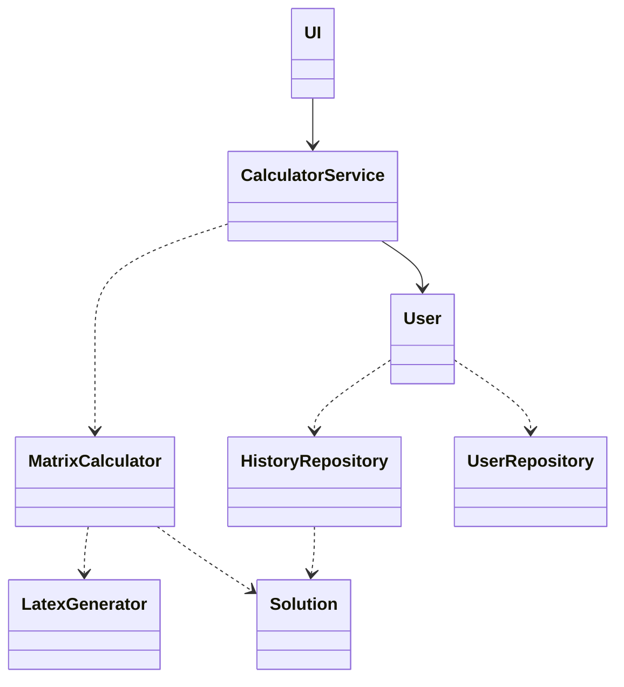
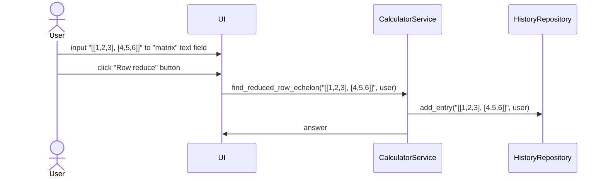

```mermaid
classDiagram
    UI --> CalculatorService
    MatrixCalculator ..> LatexGenerator
    
    User  ..> HistoryRepository
    CalculatorService ..> MatrixCalculator
    CalculatorService --> User

    HistoryRepository ..> Solution
    User ..> UserRepository 
    MatrixCalculator ..> Solution
```

##Käyttäjä suorittaa laskutoimituksen

```mermaid
sequenceDiagram
    actor User
    participant UI
    participant CalculatorService
    participant HistoryRepository
    User ->> UI: input "[[1,2,3], [4,5,6]]" to "matrix" text field
    User ->> UI: click "Row reduce" button
    UI ->> CalculatorService: find_reduced_row_echelon("[[1,2,3], [4,5,6]]", user)
    CalculatorService ->> HistoryRepository: add_entry("[[1,2,3], [4,5,6]]", user)
    CalculatorService ->> UI: answer
```    

