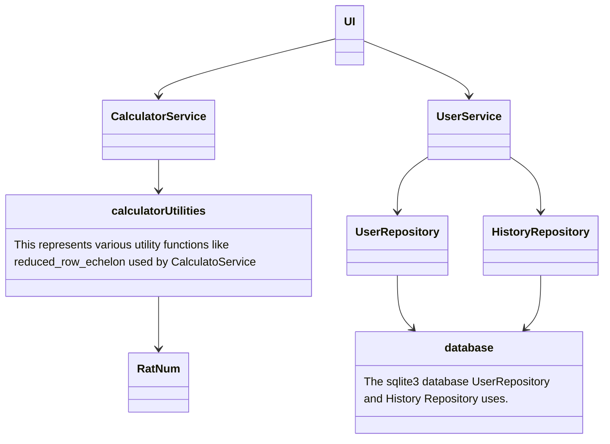
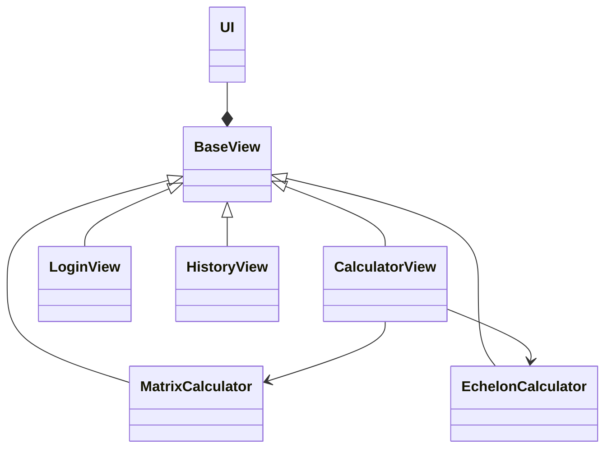
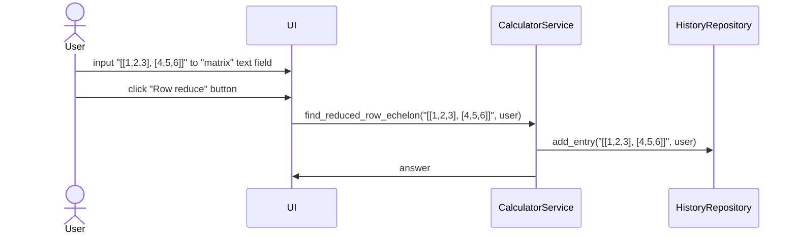

# Rakenne
Ohelma on toteutettu hyödyntäen kerrosarkkitehtuuria. Ohjelmassa on käyttöliittymästä, sovelluslogiikasta ja tietokantojen kanssa kommunikoinnista vastaavat kerrokset. Laskimen logiikkakerros hyödyntää useita laskufunktioita. Ohjelman kerrosarkkitehtuuria esittävä luokkakaavio (calculatorUtilities ja database eivät esitä luokkia):

## Käyttöliittymä
Käyttöliittymästä vastaa `UI`-luokka. Käyttöliittymätaso eli `UI` kommunikoi sovelluslogiikkatason kanssa käyttämällä `CalculatorService`- ja `UserService`-luokkia.
Käyttöliittymässä on kolme eri näkymää, `CalculatorView`, `LoginView` ja `HistoryView`. Laskinnäkymässä laskinkomponentilla on lisäksi kaksi eri välilehteä. . Näkymiä ja välilehtiä vastaavat luokat perivät `BaseView`-luokan.
Näkymien vaihtamista kontrolloi `UI`-luokka.

## Sovelluslogiikka
Rajapinnoista sovelluslogiikkaan vastaavat luokat `CalculatorService` ja `UserService`.

`CalculatorService`
käyttää useita laskennassa apufunktioita jotka taas käyttävät muita apufunktioita ja luokkia. Nämä sijaitsevat
calculator_utils -kansiossa.

`UserService`
Vastaa käyttäjän kirjautumiseen ja historiaan liittyvästä rajapinnasta. `UserService` kommunikoi repositorytason luokkien
`UserRepository`:n ja `HistoryRepository`:n kanssa.

## Tietokanta
Tietokannan kanssa kommunikoinnista vastaavat `UserRepository` ja `HistoryRepository`. Luokat käyttävät SQLite3 tietokantaa.
Luokat noudattavat Repository-mallia.

# Tominnallisuuksia

## Käyttäjä suorittaa laskutoimituksen

