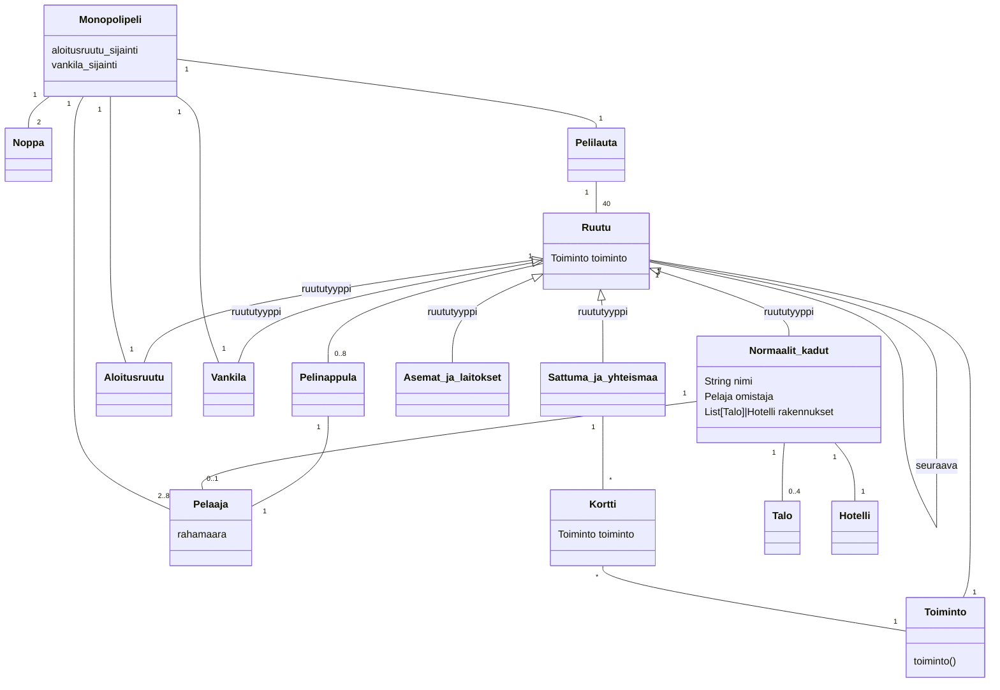

## Monopoli, luokkakaavio

```mermaid
classDiagram
    Monopolipeli "1" -- "2" Noppa
    Monopolipeli "1" -- "1" Pelilauta
    Pelilauta "1" -- "40" Ruutu
    Ruutu "1" -- "1" Ruutu : seuraava
    Ruutu "1" -- "0..8" Pelinappula
    Pelinappula "1" -- "1" Pelaaja
    Pelaaja "2..8" -- "1" Monopolipeli

    Aloitusruutu "1"--"1" Monopolipeli
    Vankila "1"--"1" Monopolipeli
    Ruutu <|-- Aloitusruutu : ruututyyppi
    Ruutu <|-- Vankila : ruututyyppi
    Ruutu <|-- Sattuma_ja_yhteismaa : ruututyyppi
    Ruutu <|-- Asemat_ja_laitokset : ruututyyppi
    Ruutu <|-- Normaalit_kadut : ruututyyppi

    Sattuma_ja_yhteismaa "1" -- "*" Kortti

    Normaalit_kadut "1" -- "0..1" Pelaaja

    Normaalit_kadut "1" -- "0..4" Talo
    Normaalit_kadut "1" -- "1" Hotelli

    Ruutu "*" -- "1" Toiminto
    Kortti "*" -- "1" Toiminto


    class Monopolipeli {
        aloitusruutu_sijainti
        vankila_sijainti
    }
    class Toiminto {
        toiminto()
    }
    class Kortti {
        Toiminto toiminto
    }
    class Pelaaja {
        rahamaara
    }
    class Ruutu {
        Toiminto toiminto
    }
    class Normaalit_kadut {
        String nimi
        Pelaja omistaja
        List[Talo]|Hotelli rakennukset
    }

```